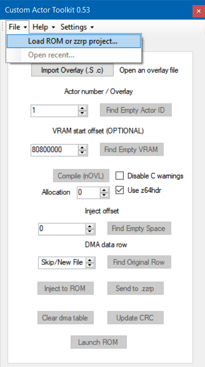
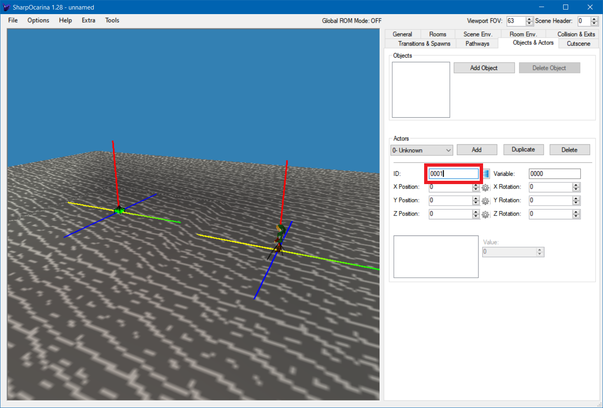

# Setup

We will set up tools and add a basic custom actor I wrote to the game, to make sure everything works.

## Your base ROM (optional)

You can probably skip this part if using a OoT 1.0 ROM.

Some versions of the OoT MQ debug ROM available for download online are known to be edited (not the vanilla/original/clean ROM). It is best to avoid using them since they cause issues when modding (random crashs).

To check if your ROM is one of those, we will compute its [md5 sum](https://en.wikipedia.org/wiki/MD5). If two ROMs have the same md5 sum, we can assume they are the same ROM.

### Open Windows PowerShell

#### Open Here (recommended)

Hold the `Shift` key and right click in a folder with your ROM and click the "Open PowerShell here" option:

You should now see the Windows PowerShell command prompt:

#### Other methods

With start menu search, search `powershell`:

Or by using the key combo `Windows+R` and executing `powershell`:

You then need to use the `cd` command to change the working directory to wherever your ROM is.

For example `cd /D E:\OoT64` (`/D` required if you switch partition, eg from `C:` to `D:`)

### Compute MD5

Copy `Get-FileHash -Algorithm MD5 -Path *` and paste it into the PowerShell prompt (with Ctrl+V with the PowerShell window active, or by right-clicking inside the PowerShell window):

Then, press enter to execute the command:

So my OoT 1.0 USA ROM has the md5 `6697768A7A7DF2DD27A692A2638EA90B`, and my MQ debug ROM has the md5 `F751D1A097764E2337B1AC9BA1E27699`.

Here are common md5 sums for MQ debug ROMs:

md5 sum | Common filename | Notes
---------------------------------- | ---------------------- | ------------------------------
`f751d1a097764e2337b1ac9ba1e27699` | baserom_original.z64   | padded with 0x00 at the end (used in decomp)
`583368d43ed0c44a8dad79f09f0f3a45` | Cleanest Debug ROM.z64 | same, with 0xFF instead of 0 as padding
`8ca71e87de4ce5e9f6ec916202a623e9` | ZELOOTMA.z64           | only zel seems to have this one
`f0b7f35375f9cc8ca1b2d59d78e35405` | baserom.z64            | decomp's baserom (no padding, PAL framerate)
`230f62c994ff072a1434df6e65e2dbe0` | ZELOOTMA.Z64           | an edited rom, **DO NOT USE** this rom for romhacking, causes many issues

If your MQ debug ROM's md5 sum isn't listed please contact me (for example, on Discord)

Again, if your ROM has the md5 `230f62c994ff072a1434df6e65e2dbe0`, find another one. The other ROMs are fine.

## Custom Actor Toolkit

### Description

Custom Actor Toolkit (or CAT for shorts) is developed by Nokaubure.

CAT allows compiling source files into overlays and injecting those overlays into the rom, as well as injecting objects.

**You can simply think of CAT as a tool for putting your custom actors into the ROM.**

### Download

Find the download link for CAT here: https://hylianmodding.com/?p=217

Direct download link for CAT 0.53: https://mega.nz/file/2Io2zboK#OzJDh9V6ownVfhC_w8HQnjmzgiv8LwY0pezKwRvOrW0 (`CustomActorToolkit0.53.zip`)

### Setup

Extract the ZIP to some empty folder.

Run the `CustomActorsToolkit` executable. If a new version is available, CAT will ask if it should update. Say "Yes" and wait for CAT to restart on its own. (latest version is 0.53 at the time of writing this)

## z64hdr

### Description

[z64hdr](https://github.com/turpaan64/z64hdr), which stands for Zelda 64 header, is maintained by [z64hdr contributors](https://github.com/turpaan64/z64hdr/graphs/contributors), and received help from [other people and groups of people](https://github.com/turpaan64/z64hdr#credits).

z64hdr is composed of a bunch of header files (`.h`) and linker scripts (`.ld`) that target specific versions of the game (OoT MQ Debug and OoT 1.0 J/U at time of writing). It is mostly copy-pasted from the [OoT MQ Debug decompilation project](https://github.com/zeldaret/oot).

**You can simply think of z64hdr as a bunch of magic files that allow you to interact with the game's code.**

(note for future tutorial updates: latest revision is [cb63c90](https://github.com/turpaan64/z64hdr/tree/cb63c9049ed7590b13c7dfd90aca264130e41e0e) at time of writing)

### Download

CAT ships with z64hdr, however to make sure you have the latest revision of z64hdr you can go to `Help > Download z64hdr`:

#### Manual z64hdr installation (optional)

In case CAT ever fails to download z64hdr, these are instructions on the manual process. Just skip these if CAT succeeds (it should be fine).

You can find z64hdr on the github repository: https://github.com/turpaan64/z64hdr

You can download the whole repository as a zip file by clicking the green "Code" button, then "Download ZIP":

Extract the ZIP and rename the `z64hdr-main` folder to `z64hdr`.

Open the folder where the `CustomActorsToolkit` executable is, and find the `gcc` folder.

Move the `z64hdr` folder into `gcc/mips64/include/`.

If you did this right, there should be a bunch of files (such as `README.md` and `oot_debug.h`) in `gcc/mips64/include/z64hdr`:

### Setup

To make CAT use z64hdr, you need to make sure the corresponding checkbox is checked:

To avoid having to check that checkbox again each time you run CAT, you can click `Settings > Save Settings` after checking the checkbox:

# Make sure everything works

## Inject a custom actor into the ROM

Download [actor.c](../custom_actor_base/actor.c) and [actor.h](../custom_actor_base/actor.h) (click `Raw` and save). These two files need to be in the same folder.

If you aren't using the OoT MQ debug ROM but the OoT 1.0 ROM instead, open `actor.h` and change `oot_mq_debug` in `#include "oot_mq_debug/z64hdr.h"` to `oot_u10`.

Open the ROM you want to inject the custom actor into with CAT (CustomActorToolkit):

Click the `Import Overlay (.S .c)` button in CAT to select the `actor.c` file you just downloaded:

Notice the `Actor number` (usually called the Actor id):

It must be unique to each actor. You can let it be `1`, that actor id is unused in the vanilla (without mods) game.

Click the `Compile (nOVL)` button:

After compiling, you always want to check CAT's console output to make sure there are no errors.

If the console is empty, click the `Compile (nOVL)` button again.

Here is what it looks like for a successful compilation:

Notice the inject offset is `0x3000000`. It is fine to leave it as is, as long as you are only injecting one custom actor into the rom, like what we are doing here.

If there are no errors in CAT's console, click the `Inject to ROM` button to inject the actor into the ROM:

## Add the custom actor to a scene

We now need to add the actor to a scene. The actor will then get loaded when entering that scene, and its code will be executed.

I will be using [SharpOcarina](https://hylianmodding.com/?p=240) to add the actor to a test scene.

Remember that in CAT the actor id (`Actor number`) was set to `1`, so we need to set the actor id to `1` in SharpOcarina:

I recommend putting the actor towards the center and Link to the side, it will work out better with what's next in this tutorial.

Inject the scene into the ROM, run the game, and load the scene you just injected.

You do *not* need to inject the scene each time you edit, compile and inject the actor. You only need to inject the scene once. You also don't need to inject the actor again if you just want to edit the scene.

If everything works, the game should not crash and display a message at the top of the screen:

If it didn't work, try going over the setup process again, and ask for help if needed.

If it worked, congratulations! You are ready to start coding custom actors.
