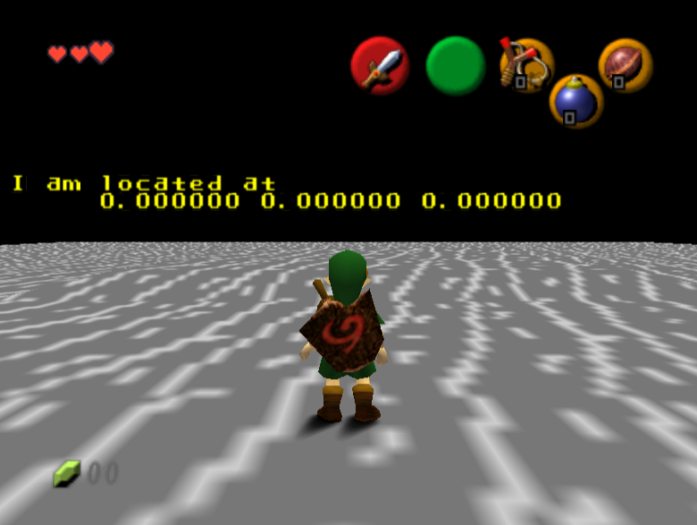

# Basics

## Actor Layout

Open the [actor.c](../custom_actor_base/actor.c) file you just downloaded.

The first line (`#include "actor.h"`) includes [actor.h](../custom_actor_base/actor.h), bringing whatever `actor.h` defines into `actor.c`.

### `actor.h`

Open [actor.h](../custom_actor_base/actor.h).

#### Include guards

<details>

<summary>

The first two lines (`#ifndef ...`, `#define ...`) and the last line (`#endif`) form an include guard.

</summary>

The first two lines

```c
#ifndef _Z_CUSTOMACTOR_H_
#define _Z_CUSTOMACTOR_H_
```

and the last line

```c
#endif
```

form an [include guard](https://en.wikipedia.org/wiki/Include_guard), which is typically used in C to prevent the contents of `actor.h` of being duplicated in case of it being included twice (with `#include`).

</details>

Just don't touch them, and add anything you want to add in `actor.h` between those lines.

#### Include z64hdr

Like `#include "actor.h"` did in `actor.c`, here in `actor.h` the line `#include "z64hdr/oot_debug.h"` brings z64hdr definitions to `actor.h`, and to `actor.c`.

#### CustomActor struct

```c
typedef struct CustomActor {
    Actor actor;
} CustomActor;
```

A `struct` (structure) defines how to use some memory.

Each actor has its own struct, but they all share the same base struct, `Actor`, which holds generic actor data such as actor id, position, speed...

It is considered good practice in C to put such definitions in header files (`.h`), and include those header files in source files (`.c`), like we do here.

### `actor.c`

Open [actor.c](../custom_actor_base/actor.c) again.

#### Forward declarations

```c
void CustomActor_Init(Actor* thisx, GlobalContext* globalCtx);
void CustomActor_Destroy(Actor* thisx, GlobalContext* globalCtx);
void CustomActor_Update(Actor* thisx, GlobalContext* globalCtx);
void CustomActor_Draw(Actor* thisx, GlobalContext* globalCtx);
```

These are [forward declarations](https://en.wikipedia.org/wiki/Forward_declaration). They indicate that the functions exist and will be defined later.

#### Init vars

"Init vars", as they are referred to, ("initialization variables") hold generic settings used when spawning an actor, for xample when a scene/room loads.

```c
const ActorInit initvars = {
    1,
    ACTORCAT_MISC,
    0x00000030,
    OBJECT_GAMEPLAY_KEEP,
    sizeof(CustomActor),
    (ActorFunc)CustomActor_Init,
    (ActorFunc)CustomActor_Destroy,
    (ActorFunc)CustomActor_Update,
    (ActorFunc)CustomActor_Draw,
};
```

If you find the `ActorInit` struct definition in [z64hdr](https://github.com/turpaan64/z64hdr) (hint: it's in [z64actor.h](https://github.com/turpaan64/z64hdr/blob/main/include/z64actor.h)), you can see what each value is for.

##### Actor id and category

`1` is the actor id.

`ACTORCAT_MISC` is the actor category. You may as well only use that one. See the `ActorCategory` enum in `z64actor.h` for a list of categories.

##### Actor Flags

`0x00000030` are the actor flags. It is a [bitfield](https://en.wikipedia.org/wiki/Bit_field), meaning each bit (a 0 or a 1 when written in binary) sets or unsets a property.

For example, `0x00000030` in binary is `0011 0000`. The 5th bit (the right-most `1`) indicates that the actor should always update, and the 6th bit (the left-most `1`) indicates that the actor should always draw.

Some actor flags are documented on [the CloudModding wiki](https://wiki.cloudmodding.com/oot/Actors#Initialization_Variables).

##### Object, struct size

`OBJECT_GAMEPLAY_KEEP` sets the actor's object. An object holds data used by an actor, such as graphics data, collision...

Without going into details (yet), using `OBJECT_GAMEPLAY_KEEP` acts as if the actor didn't use an object.

`sizeof(CustomActor)` indicates how much memory the `CustomActor` struct needs.

##### Init, Destroy, Update, Draw

```c
    (ActorFunc)CustomActor_Init,
    (ActorFunc)CustomActor_Destroy,
    (ActorFunc)CustomActor_Update,
    (ActorFunc)CustomActor_Draw,
```

These tell the engine what functions to call to make the actor perform operations.

* The Init function (here `CustomActor_Init`) is called when the actor spawns (for example on scene/room entry). For example, an actor may load its collision.

* The Destroy function is called when the actor is unloaded (for example when leaving the scene/room). For example, an actor may unload its collision to free memory.

* The Update function is called every frame to make the actor update itself. For example, an actor may move by changing its position.

* The Draw function is called every frame to make the actor draw itself.

Note: Update and Draw are only called every frame that the actor is on camera (not culled), unless some actor flags are set (see actor flags above). This custom actor base sets the flags so that Update and Draw are always run every frame regardless of the actor being culled or not.

#### Function definitions

The four functions Init, Destroy, Update, Draw all take the same arguments and return nothing (`void`).

```c
void CustomActor_Init(CustomActor* this, GlobalContext* globalCtx) {

}
```

The first argument is `CustomActor* this`, a [pointer](https://en.wikipedia.org/wiki/Pointer_(computer_programming)) to the memory used by the custom actor struct.

The second argument `GlobalContext* globalCtx` is a pointer to the structure known as the ["global context"](https://wiki.cloudmodding.com/oot/Global_Context_(Game)). Basically, the global context stores or points to everything the game needs to run.

You can find the definition of the `GlobalContext` struct in [z64.h](https://github.com/turpaan64/z64hdr/blob/main/include/z64.h).

As you can see, Init, Destroy and Update have an empty body (nothing between the curly brackets `{`, `}`). This actor does nothing but drawing.

## Your first actor code

I will be using comments in C to give details. The syntax for comments in C is:

```c
// a single-line comment that ends when the line ends
/* a multi-line comment that ends
whenever you want it to */
```

If you want to tinker with the Draw function (`CustomActor_Draw`) you should only touch the lines with `GfxPrint_SetColor`, `GfxPrint_SetPos`, `GfxPrint_Printf`.

For example, this prints the actor's XYZ coordinates in the middle of the screen:

```c
// opaque yellow
GfxPrint_SetColor(&printer, 255, 255, 0, 255);
// in the middle of the screen vertically
GfxPrint_SetPos(&printer, 1, 10);
// %f for floating point (decimal) values
GfxPrint_Printf(&printer, "I am located at");
// in the middle of next line
GfxPrint_SetPos(&printer, 6, 11);
// %f for floating point (decimal) values
GfxPrint_Printf(&printer, "%f %f %f", this->actor.world.pos.x, this->actor.world.pos.y, this->actor.world.pos.z);
```



As training I would now like you to print a message, in green and near the bottom of the screen, telling how far horizontally the actor is from Link.

The horizontal distance to Link is stored in `this->actor.xzDistToPlayer`. It is a floating point value, so use `%f`. Have fun :)

# TODO

<details>

    GfxPrint_SetColor(&printer, 0, 255, 0, 255);
    GfxPrint_SetPos(&printer, 1, 20);
    GfxPrint_Printf(&printer, "Link is %f units away horizontally", this->actor.xzDistToPlayer);

</details>
