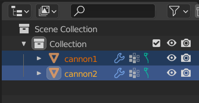
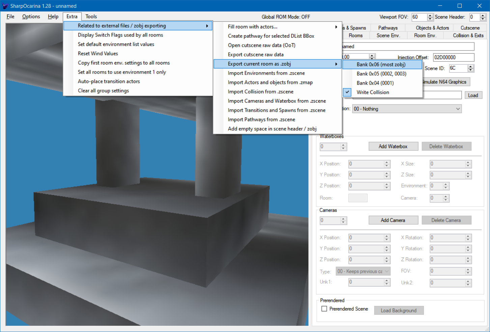

# Graphics

We will get our actor to actually draw something we modeled in game, rather than just text on the screen.

## Modeling

In this tutorial we will be making a cannon actor.

The first step is modeling a cannon. I will be using Blender. Here's what I ended up with:


I made the texture from [this image](https://www.readyarc.ca/wp-content/uploads/2017/05/bigstock-metal-texture-16829510-768x768.jpg).

I encourage you to make your own model, I am not providing the blend file. Hopefully yours looks better than mine, but making an even more basic model would be fine.

## Make an object file

Most data used by actors, such as graphics data, textures, collision (and other stuff), is stored in files refered to as object files, or just "objects". They are also called zobj, because `.zobj` is a common file extension used for objects in modding.

We need to create the object file. There are several tools to do it, we will use SharpOcarina for now.

<details>

<summary>

Make sure your model in Blender is a single mesh.

</summary>

Good:


Not good:



If you have several meshes, join them into one (select them, and `Ctrl+J` or `Mesh > Join`)

Having several meshes means SharpOcarina will export each one into the object individually, and each mesh will need to be drawn separately. This can be useful, but not in our case. It will be less confusing to use a single mesh.

</details>

To avoid SharpOcarina exporting collision for the cannon model, add a `#NoCollision` [tag](/sharpocarina_tags.md) to the mesh object, for example:


Export the blend to `.obj` like you would for a map. I'm using Blender 2.93, the SharpOcarina obj exporter addon (`Wavefront SharpOcarina (.obj)`) and default export settings.

Open SharpOcarina, create a new scene. Load the `.obj` you just exported as the `Collision Model`. Load your `.obj` with `Add Single Room` in the `Rooms` tab.

In the `General` tab, set the `Scale` so that the model looks like the size you would like to have it in-game.

If you modeled your cannon really big in Blender, you may end up with a scale like `0.01`. If really small, something like `100`. It depends, any value is fine. For my model, I thought `15` was nice:


<details>

<summary>

Now, multiply that scale by 100.

</summary>

The reason is, coordinates in object files are stored as integers, so to avoid loosing precision (for example `x=1.2` becoming `x=1`) the models are usually stored with a big scale in the object file, and scaled down when drawn. The default scale for scaling down is `1/100`, which is why I'm making you multiply the scale by 100.

</details>

For me the result is `15*100 = 1500` which is above the maximum SharpOcarina allows (`1000`), so instead I'm going to scale my model in Blender by `15`, export to `.obj` again and set the scale in SharpOcarina to `100`.


It's time to export the model to a zobj (object file), click `Extra > Related to external files / zobj exporting > Export current room as .zobj > Bank 0x06 (most zobj)`:



Choose the location and name of the zobj file, then a window like this one should pop up:


Close the window and paste in a text file what SharpOcarina just copied to the clipboard. For me:

```
Collision Offset 00000800
Group cannon#NoCollision Offset 000013E0
```

Collision is still exported even though we specified `#NoCollision` on the cannon mesh object, the effect `#NoCollision` had is to not include the cannon in the collision (so the collision is empty). Simply ignore it, we won't use it for now.

The line we are interested in is `Group cannon#NoCollision Offset 000013E0`. It means the offset of interest we want to use to draw the cannon model is `0x13E0` into the zobj. Mark down whatever offset you have somewhere, we will need it later!

## Inject the object file

Let's injecting the object into the ROM. This can be done with CAT.

Open CAT if it isn't already open, load a ROM if needed, and go to the `Objects` tab:


Click `Import Zobj...` and choose the zobj you just exported with SharpOcarina.

Each object has its unique ID (identifier, a number). Using an object ID that is already used will replace the previous object.

Click `Find Empty Object ID` to find an unused object ID for your zobj. If your ROM didn't have any custom object added yet, it will be `4`.


Click `Find Empty Space`. This is very important to not overwrite important data in the ROM, such as your custom actor.


Finally, click `Inject to ROM`. A "success" window should pop up:


# Make the actor use the object file

The object used by an actor is defined by the actor's init vars.

Look at your `actor.c`:

```c
const ActorInit initvars = {
    1,
    ACTORCAT_MISC,
    0x00000030,
    OBJECT_GAMEPLAY_KEEP,
    sizeof(CustomActor),
    (ActorFunc)CustomActor_Init,
    (ActorFunc)CustomActor_Destroy,
    (ActorFunc)CustomActor_Update,
    (ActorFunc)CustomActor_Draw,
};
```

Currently the actor sets object ID `OBJECT_GAMEPLAY_KEEP` (`1`, as you can see [here](https://github.com/turpaan64/z64hdr/blob/main/include/z64object.h)).

`gameplay_keep` is a special object that is always loaded. It is often used by actors who don't need to use an object, like our custom actor until now.

To make the actor use our new object, we need to set the object ID to the one we used to inject the zobj in CAT. Replace `OBJECT_GAMEPLAY_KEEP` by the ID you used previously.

For example I injected my zobj with ID `4` so I'm replacing `OBJECT_GAMEPLAY_KEEP` with `4`:

```c
const ActorInit initvars = {
    1,
    ACTORCAT_MISC,
    0x00000030,
    4,
    sizeof(CustomActor),
    (ActorFunc)CustomActor_Init,
    (ActorFunc)CustomActor_Destroy,
    (ActorFunc)CustomActor_Update,
    (ActorFunc)CustomActor_Draw,
};
```

We still need to make the actor draw the cannon model, but I first want to make sure the actor still load as is. The list of loaded objects is defined by each room in a scene, and if an object used by an actor is not loaded then the actor will simply not spawn.

Inject the actor, which is now set to use our custom zobj, into the ROM with CAT, but this time click `Find Empty Space` before injecting.

We are now injecting several files into the ROM (an actor and an object), so if you don't click `Find Empty Space` every time before injecting either an actor or an object, you may for example end up overwriting part of the object when injecting the actor. This can lead to mysterious crashes.

Also don't forget to click `Find Empty Space` *after* compiling the actor, not before.


We now need to inject the scene and rooms with our custom actor again, this time with the object list including our custom object.

If you are using SharpOcarina's Global ROM Mode (`File > Open Global ROM`), all you need to do is to reload the ROM (with the green circling arrow at the top of the window near `Global ROM Mode: ON`) and inject the scene again. SharpOcarina will tell you the missing object (for me, `0004` or just `4`) was added where needed.

If it doesn't add the object automatically, make sure that:
- `Options > Add required actor objects on save` is checked in SharpOcarina
- You injected your custom actor with the new object ID in its init vars
- You refreshed the loaded Global ROM in SharpOcarina


If you are not using SharpOcarina's Global ROM Mode, you can add the object manually in the `Objects & Actors` tab in SharpOcarina, and inject.

In the end, the object list should show your custom object ID (for me, `4`):


You can now launch the ROM and the actor should work just like it did before we made it use a custom object.

## Drawing the model

Remember when you create the `.zobj` file with SharpOcarina? It copied something like

```
Collision Offset 00000800
Group cannon#NoCollision Offset 000013E0
```

to the clipboard. As I said previously, `000013E0` means the offset into our custom object that we need to draw the cannon is `0x13E0`.

### Segment addresses

At this point I need to introduce what is known as "segment addresses" or "segment offsets". A segment address is of the form `0xSSYYYYYY`, where `SS` is the "segment" and `YYYYYY` is the "offset".

Each "segment" `SS` is associated to a RAM address. For example, segment 2 `SS = 02` is associated to the RAM address of the current scene file loaded in RAM.

We are interested in using segment 6 `SS = 06`, because segment 6 is associated to the RAM address where the object file of the current actor is loaded.

When resolving a segment address like `0xSSYYYYYY`, the base address for segment `SS` is used, and the offset `YYYYYY` is added to it.

For example, segment address `0x06000000` refers to the start of the current object file.

SharpOcarina gave the offset `0x13E0` into the object file for my model. So, to refer to offset `0x13E0` in the actor's object file, I will use `SS = 06` (current object file) and `YYYYYY = 0013E0`, which means the segment address `0x060013E0`.

### Drawing

Now that you figured out the segment address to use, it's time to actually make our actor draw something.

It is as simple as adding the following function call in the draw function:

```c
// use your own segment address instead of 0x060013E0 !
Gfx_DrawDListOpa(globalCtx, 0x060013E0);
```

You can remove the on-screen text drawing, if you don't then make sure to add the `Gfx_DrawDListOpa` function call at the end of the draw function, not in the middle of the text drawing code.

```c
void CustomActor_Draw(CustomActor* this, GlobalContext* globalCtx) {
    ...
    globalCtx->state.gfxCtx->polyOpa.p = gfx;

	// if you don't remove the text drawing code, put this at the end!
	Gfx_DrawDListOpa(globalCtx, 0x060013E0);
}
```

You can now compile the actor, inject it (again, don't forget to click `Find Empty Space` right before injecting!), and launch the ROM.

If the game freezes as you load the scene, you likely are using a wrong segment address in `Gfx_DrawDListOpa`. Remove the `Gfx_DrawDListOpa` function call and compile/inject/run to make sure that the `Gfx_DrawDListOpa` call is indeed the issue. If it is, check your segment address. If the segment address looks fine, make sure your offset is up-to-date with the zobj currently injected into the ROM.

If the scene loads but nothing is visible, make sure you did use a scale multiplied by 100. Look carefully at where the actor should be, it may just be tiny.

If everything works, you should see your model in-game.


## Cannon logic

Now that our actor looks like a cannon, let's make it behave like a cannon attacking Link. It already is damaging Link every few seconds if Link is too close, that's a start.

I bumped up the distance at which Link takes damage to 300 units, and added this to the update function:

```c
// face Link if he is closer than 400 units away
if (this->actor.xzDistToPlayer < 400.0f) {
	this->actor.shape.rot.y = this->actor.yawTowardsPlayer;
}
```

`this->actor.shape.rot.y` is the visual rotation of the actor around the `y` axis.

`this->actor.yawTowardsPlayer` is the angle the player is at relative to the actor.

Try it for yourself. For me the result isn't what I had in mind:


The cannon does rotate with Link but does not face him. It would need to rotate 90 more degrees around the y axis. Yours may be off by 90 degrees in the opposite direction, or by 180 degrees, or be facing Link already. It depends on the direction you modeled the cannon in, in Blender.

`this->actor.shape.rot.y` and `this->actor.yawTowardsPlayer` are `s16` angles. With `s16` angles, 90° corresponds to `0x4000` (and 180° to `0x8000`, `-90°` to `-0x4000`...).

So all I need to do in my case to make the cannon face Link is use `this->actor.yawTowardsPlayer + 0x4000` instead of `this->actor.yawTowardsPlayer`, that way the cannon will be rotated 90° more, towards Link.

`this->actor.shape.rot.y = this->actor.yawTowardsPlayer + ...;` makes it so that the cannon's rotation jumps to be towards Link, which looks weird. We can use the `Math_SmoothStepToS` function instead. You can read what it does by finding it [in this file](https://github.com/zeldaret/oot/blob/master/src/code/z_lib.c). 

```c
Math_SmoothStepToS(&this->actor.shape.rot.y, this->actor.yawTowardsPlayer + 0x4000, 2, 0x100, 0x10);
```

Notice that we pass a pointer to `this->actor.shape.rot.y` (the address) with `&this->actor.shape.rot.y` (notice the `&`).

Play with the last three arguments a bit to find values you like.

## Effects

The game has a particle system called "effects". There are a lot of different particles. I looked at the [bomb actor](https://github.com/zeldaret/oot/blob/master/src/overlays/actors/ovl_En_Bom/z_en_bom.c) to find what I'm showing here.

This spawns a fuse spark above the actor. I made the actor do it when Link is in the range to be damaged.

```c
Vec3f effPos = this->actor.world.pos;
Vec3f effVelocity = { 0.0f, 0.0f, 0.0f };
Vec3f effAccel = { 0.0f, 0.0f, 0.0f };
effPos.y += 100.0f;
EffectSsGSpk_SpawnFuse(globalCtx, &this->actor, &effPos, &effVelocity, &effAccel);
```

I also made it play a fizzling sound under the same conditions.

```c
Audio_PlayActorSound2(&this->actor, NA_SE_IT_BOMB_IGNIT - SFX_FLAG);
```

And when damaging the player I made it play another sound to mimick shooting a cannon ball.

```c
Audio_PlayActorSound2(&this->actor, NA_SE_IT_BOMB_EXPLOSION);
```

Notice one has `- SFX_FLAG`, the other doesn't. Without `- SFX_FLAG` the sound will play fully. With `- SFX_FLAG` the sound will only play as long as it is played every frame.

`Audio_PlayActorSound2` isn't the only function for playing sound. There are many, but the differences between all the functions for playing sounds aren't very clear at the moment.

## Result

Here is what my update function ends up looking like.

```c
void CustomActor_Update(CustomActor* this, GlobalContext* globalCtx) {
    // tick down to 0
    if (this->dontHitPlayerTimer > 0) {
        this->dontHitPlayerTimer--;
    }
	
    // damage Link if he gets 300 units or closer
    if (this->actor.xzDistToPlayer < 300.0f) {
		// fuse sparkle effect
		Vec3f effPos = this->actor.world.pos;
		Vec3f effVelocity = { 0.0f, 5.0f, 0.0f };
		Vec3f effAccel = { 0.0f, -0.5f, 0.0f };
		effPos.x += 8.0f;
		effPos.y += 75.0f;
		EffectSsGSpk_SpawnFuse(globalCtx, &this->actor, &effPos, &effVelocity, &effAccel);
		
		Audio_PlayActorSound2(&this->actor, NA_SE_IT_BOMB_IGNIT - SFX_FLAG);
		
        if (this->dontHitPlayerTimer == 0) {
            if (gSaveContext.health > 0) {
				Audio_PlayActorSound2(&this->actor, NA_SE_IT_BOMB_EXPLOSION);
                // damage by a full heart
                gSaveContext.health -= 16;
                // do not damage Link again for 60 frames (3 seconds)
                this->dontHitPlayerTimer = 60;
            }
        }
    }
	
	// rotate towards Link if he is closer than 400 units
    if (this->actor.xzDistToPlayer < 400.0f) {
		Math_SmoothStepToS(&this->actor.shape.rot.y, this->actor.yawTowardsPlayer + 0x4000, 2, 0x600, 0x100);
	}
}
```

[Demo video](cannon_graphics_demo.webm)
