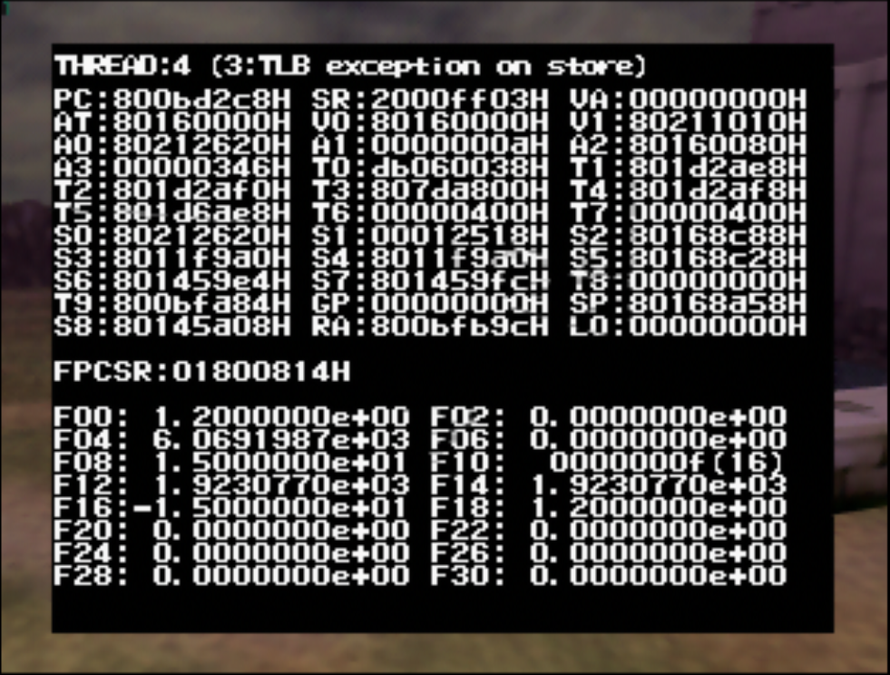
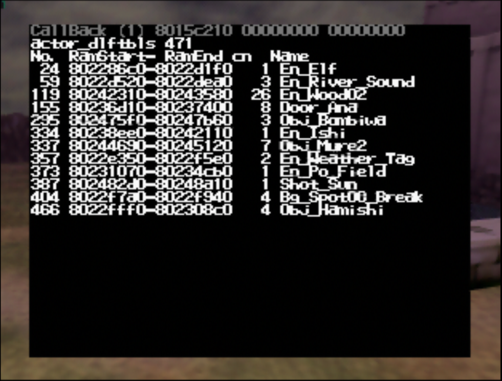

# Crash Screen

For demonstration, I have added the following in `Play_Update`:

```c
if (input->press.button & BTN_DDOWN) {
    u32* garbagePointer = (u32*)0;

    // crashes
    *garbagePointer = 0;
}
```

This allows me to crash the game during the Play state (basically anytime outside of file select) by pressing the DPad-Down button.

I will be showcasing the GC version of the crash screen. You should also read the documentation at the top of `src/code/fault_gc.c` for more information.

## Setting up

To be usable, the crash screen must be fixed (at least its GC version). I also recommend making various changes and additions, including using the GC version of the crash screen on N64 versions, see [Setup](setup.md).

## Controls

See the documentation at the top of `src/code/fault_gc.c` for full information.

The most important controls are the L button and A/DPad-Right buttons.

By default, the crash screen automatically scrolls through its available pages at a fixed time interval. This behavior can be toggled off and on by pressing L.

When the automatic scrolling is disabled, you can press either A or DPad-Right to go to the next page.

There is no way to go back one page: instead, going to the next page from the last page brings you back to the first page.

## Pages

The information provided by the crash screen is split up between pages.

### Thread Context page

The first page is the thread context page.



It shows the thread id of the thread that crashed (see `THREAD_ID_` values in `include/thread.h`). Most commonly this will be 4 aka `THREAD_ID_GRAPH`, the graphics thread being the one where the game spends the most time, including doing the whole update and draw cycles.

It also shows the exception cause. The most common causes are:

- TLB exception on load
- TLB exception on store
    - Since OoT does not use the TLB, these two usually mean a garbage pointer was dereferenced on a read/write operation respectively, for example a `NULL` access.
- Floating point exception
    - This happens when some floating point operation fails (an operation involving `float` or `double` types, basically). In that case, the specific floating point exception cause will be shown on the "FPCSR" line.

The rest of the screen shows the values of the registers at the point of the crash. The lower half shows the floating point registers.

### Stack Trace page

A [stack trace](https://en.wikipedia.org/wiki/Stack_trace) reports the current location of execution in the current function, and from where in a second function that function was called, and from where that second function was itself called, and so on.


See [Stack Trace](stack_trace.md).

### Loaded Actors pages

This page lists the z64 overlays currently loaded.



The columns indicate in order the actor id, the location in ram of the z64 overlay, the amount of actors currently spawned, and the actor debug name if available (if `DEBUG_FEATURES`).
