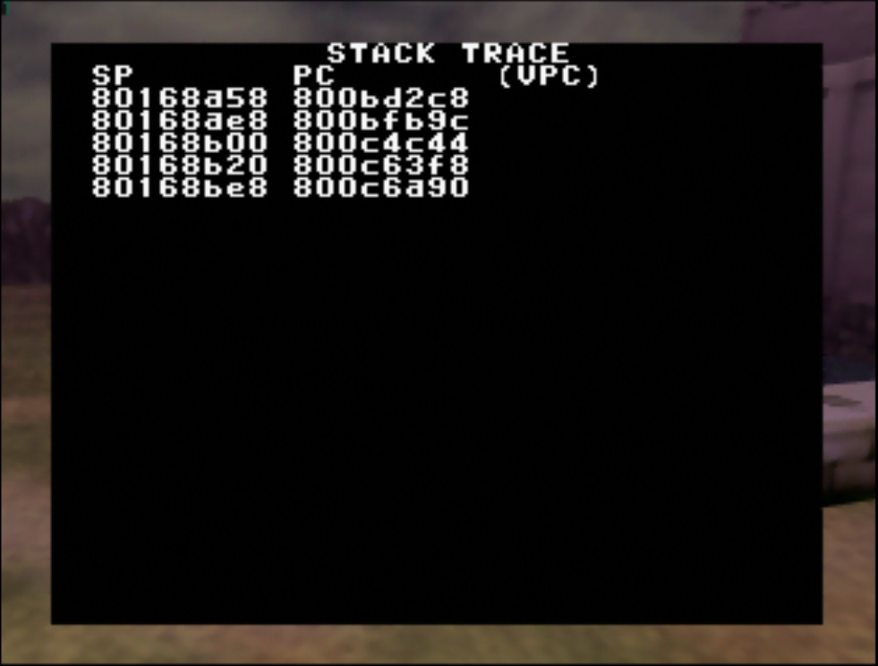
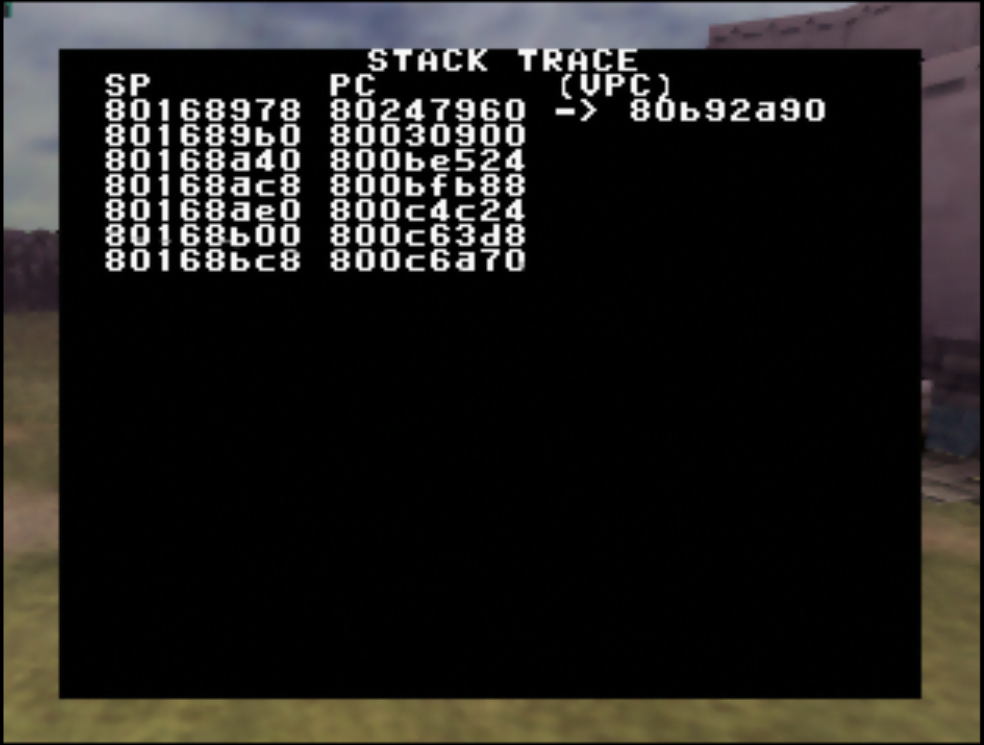
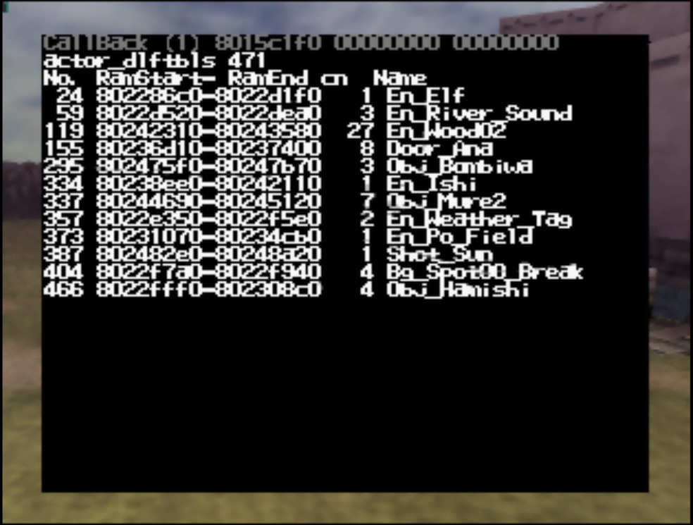

# Stack Trace

The stack trace page looks like this:



Each line of the stack trace indicates a SP, PC and optionally VPC value.

SP stands for Stack Pointer, PC for Program Counter and VPC for Virtual Program Counter.

The first line in the trace corresponds to the spot that faulted (caused a crash).

The second line in the trace corresponds to the spot that called the function where the crash occurred.

The third line corresponds to the spot that called the function where the second line's spot is, and so on.

**CAVEAT**: Note that if you use the gcc compiler instead of ido, the crash screen is not smart enough to always produce a correct trace and then only the first few lines (or even only the first line) can be trusted. This has been addressed in some romhacks codebases, for example https://github.com/Dampes-Hut/escaperoom/blob/dragorns_bleeding_edge/src/code/escaperoom/fault.c#L1102 , but afaik remains to be ported for general use.

## Using the stack trace

For debugging, we are mostly interested in the PC and VPC columns.

The PC or Program Counter is the address of the instruction corresponding to each line.

### `sym_info.py`

We can look up the function for each of those addresses using the `sym_info.py` script located in the decomp repo.

You need to pass the version you're building to `sym_info.py` with `-v`. For example if building ntsc-1.0, use `./sym_info.py -v ntsc-1.0`.

```sh
$ ./sym_info.py -v gc-eu-mq-dbg 0x800BD2C8
0x800BD2C8 is at 0x28 bytes inside 'Play_Update' (VRAM: 0x800BD2A0, VROM: 0xB34540, SIZE: 0x1A40, build/gc-eu-mq-dbg/src/code/z_play.o)
```

This tells us the crash happened in `Play_Update` (as expected, that's where I put the code to crash the game), more specifically `0x28` bytes into it.

In this case it is enough to know that the crash happens in `Play_Update` as that function is called in one spot, so looking at the next lines of the trace won't bring us any useful information. But sometimes, especially when the crash happens in library or helper functions that get called in several places, it is helpful to also run `sym_info.py` on the PCs of the other trace lines.

### `objdump`

We now know that the crash happened at `Play_Update+0x28`. But which line of code in the source .c file is that?

We can figure it out using the `objdump` program, specifically `mips-linux-gnu-objdump`. You have installed it already as part of setting up the repo by installing `binutils-mips-linux-gnu`.

`sym_info.py` also gave us the path to the .o file. In the above example, it was `build/gc-eu-mq-dbg/src/code/z_play.o`. We pass it along with some flags to `objdump`:

```sh
mips-linux-gnu-objdump --disassemble --reloc --source build/gc-eu-mq-dbg/src/code/z_play.o
```

Or equivalently with short options:

```sh
mips-linux-gnu-objdump -drS build/gc-eu-mq-dbg/src/code/z_play.o
```

`objdump` will print a disassembly to standard output, interleaved with source lines. Source lines are printed before the instructions they correspond to. You may find it easier to navigate by piping the output to a file and opening that file:

```sh
mips-linux-gnu-objdump -drS build/gc-eu-mq-dbg/src/code/z_play.o > z_play_disas.txt
```

Note the offsets are relative to the start of the file, and not relative to the start of each function.

Note that instead of `--disassemble` or `-d` which will cause `objdump` to disassemble the whole file, you can also use `--disassemble=Play_Update` to disassemble just the single function of interest.

Locate the Play_Update function: 

```c
000010f0 <Play_Update>:

void Play_Update(PlayState* this) {
    10f0:	27bdff70 	addiu	sp,sp,-144
```

This tells us that `Play_Update` is `0x10F0` bytes into `z_play`. We know the crash is at `Play_Update+0x28`, so we add `0x28` to that initial `0x10F0` offset and get `0x10F0+0x28=0x1118`. Then we look at what is at offset `0x1118`:

```c
        *garbagePointer = 0;
    1118:	ac000000 	sw	zero,0(zero)
```

No surprise, we find the line that I wrote specifically to crash the game!

## z64 overlays

If the trace goes through a z64 overlay, for example if the crash happens inside an actor's code, the PC column still reports the address in memory. However since z64 overlays are loaded are dynamic locations, that PC address cannot be directly looked up as done above using `sym_info.py`. Instead, we need to convert the address to the corresponding virtual address.

For the following example and screenshots I moved the "DPad-Down crashes the game" code to `ObjBombiwa_Update`.

The stack trace now looks like:



Note the VPC column is no longer empty, as I have the "Fill VPC in crash handler for actor overlays, to facilitate debugging" commit applied as recommended in [Setup](setup.md).

We can look up this VPC value directly using `sym_info.py`:

```
$ ./sym_info.py -v gc-eu-mq-dbg 0x80B92A90
0x80B92A90 is at 0x28 bytes inside 'ObjBombiwa_Update' (VRAM: 0x80B92A68, VROM: 0xF41D58, SIZE: 0x120, build/gc-eu-mq-dbg/src/overlays/actors/ovl_Obj_Bombiwa/z_obj_bombiwa.o)
```

And then continue the analysis as detailed above.

### Computing the VPC by hand

What follows is an explanation of how to compute the virtual address (VPC value) given a PC located in a z64 overlay.

First, note down the PC to be converted. Here, `PC=0x80247960`.

Then, head to the "loaded actors" page of the crash screen:



Find the z64 overlay where the target PC belongs, using the reported ram range for each z64 overlay. Here, we find that `0x80247960` belongs to the range `0x802475F0-0x80247B70`, so `Obj_Bombiwa`.

Note down the actor's id and start of the ram range. Here, `ActorID=295=0x0127` and `RamStart=0x802475F0`.

Then, find the z64 overlay segment name from the actor id. To do so, open `include/tables/actor_table.h` and locate the line corresponding to the actor:

```c
/* 0x0127 */ DEFINE_ACTOR(Obj_Bombiwa, ACTOR_OBJ_BOMBIWA, ACTOROVL_ALLOC_NORMAL, "Obj_Bombiwa")
```

The first argument of `DEFINE_ACTOR` is what we're after: `Obj_Bombiwa`. It means the segment name is `ovl_Obj_Bombiwa`.

Then, open the map file corresponding to the version you are building: `build/VERSION/oot-VERSION.map`. For example if you are building ntsc-1.0, then `build/ntsc-1.0/oot-ntsc-1.0.map`.

Since the segment name is `ovl_Obj_Bombiwa`, look for `_ovl_Obj_BombiwaSegmentStart`. You will find exactly one line, that looks like:

```
                0x80b92720                        _ovl_Obj_BombiwaSegmentStart = .
```

This address is the start virtual address of the ovl_Obj_Bombiwa segment. Note it down. Here `VirtualAddress=0x80B92720`.

Then we can finally compute the VPC value as:

```
VPC = PC - RamStart + VirtualAddress
    = 0x80247960 - 0x802475F0 + 0x80B92720
    = 0x80B92A90
```

Which is exactly the value we already have in the VPC column!
