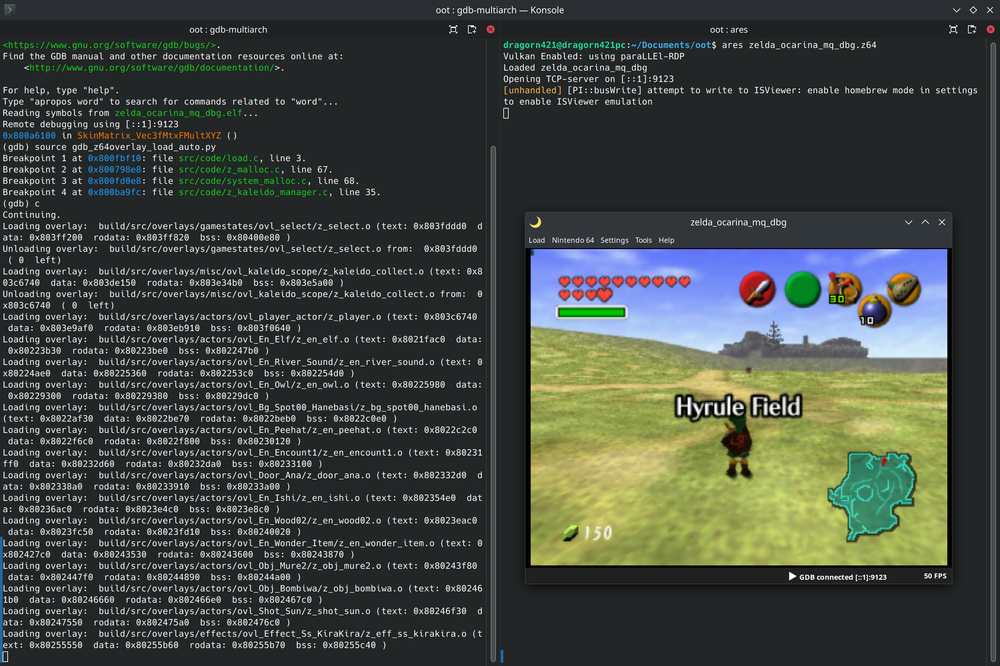
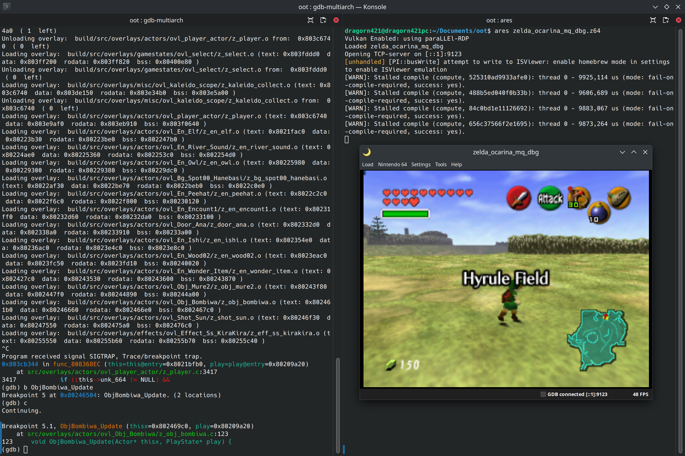

# GDB and z64 overlays

You will probably be interested in debugging code inside z64 overlays, such as most actors. These pieces of code are loaded at arbitrary locations in memory, so we need specific handling to tell gdb about where each is loaded.

## Download the scripts

You may use one of two scripts to load the z64 overlays into gdb:

- "auto" [gdb_z64overlay_load_auto.py](scripts/gdb_z64overlay_load_auto.py)
- "manual" [gdb_z64overlay_load_manual.py](scripts/gdb_z64overlay_load_manual.py)

The "auto" one automatically loads and unloads z64 overlays into gdb as they are loaded and unloaded by the game.

The "manual" one provides a command to load a specific z64 overlay manually.

I recommend the "auto" one, but it may cause excessive slowdowns in some environments (room loads taking dozens of seconds), if this happens to you you may want to use the "manual" one instead.

WARNING: the "manual" script may be broken at the current time

## Run the script in gdb

Save your chosen script somewhere. The simplest location is inside your oot repo.

You can run a script with the gdb command `source path/to/script.py`. For example `source gdb_z64overlay_load_auto.py` if you ran gdb in the same folder as `gdb_z64overlay_load_auto.py` is in.

If using the "auto" script, you want to then load a new scene for the script to catch the z64 overlays loading and load them in gdb.

For example in the following screenshot:



We can see I opened the map select menu, causing the map select game state to load:

```
Loading overlay:  build/src/overlays/gamestates/ovl_select/z_select.o (text: 0x803fddd0  data: 0x803ff200  rodata: 0x803ff820  bss: 0x80400e80 )
```

Then it was unloaded after I chose a map:

```
Unloading overlay:  build/src/overlays/gamestates/ovl_select/z_select.o from:  0x803fddd0  ( 0  left)
```

I loaded into Hyrule Field, causing a bunch of z64 overlays to load, including many actors, like `ObjBombiwa`:

```
Loading overlay:  build/src/overlays/actors/ovl_Obj_Bombiwa/z_obj_bombiwa.o (text: 0x802461b0  data: 0x80246660  rodata: 0x802466e0  bss: 0x802467c0 )
```

Then a breakpoint can be added inside a z64 overlay and it will work as expected. For example `b ObjBombiwa_Update`, after moving in range of the nearest Hyrule Field bombiwa:



If you used the "manual" script, you need to run `ovl ...` to load an overlay before using its symbols (e.g. to set a breakpoint). For example run `ovl ACTOR_OBJ_BOMBIWA` before `b ObjBombiwa_Update`.
