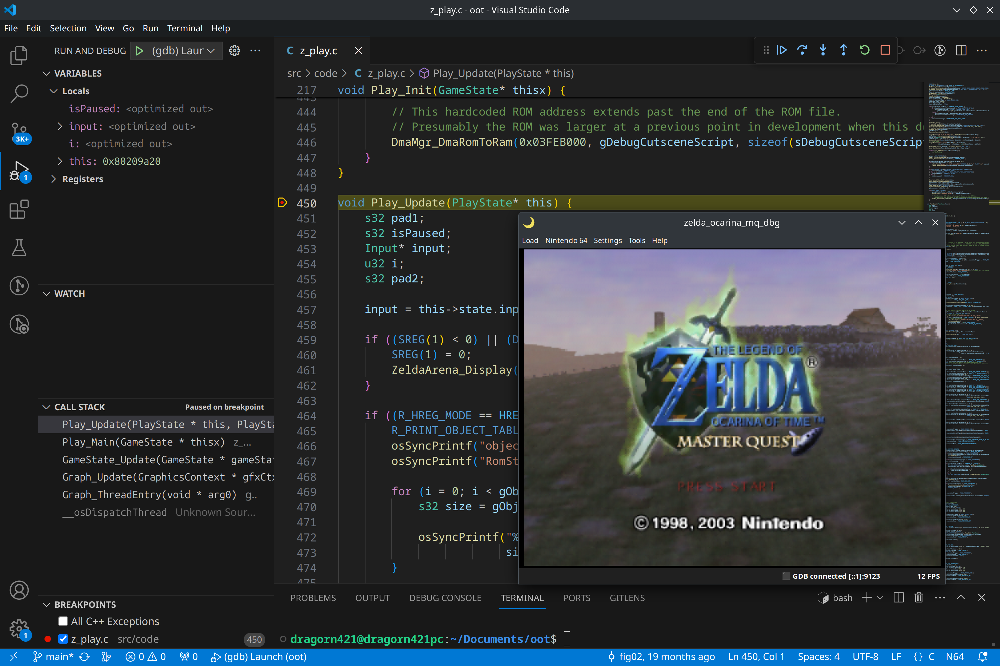

# gdb

GDB (https://sourceware.org/gdb/) is the GNU Debugger. It allows inspecting programs while they're running, for example tracing execution, placing breakpoints, stepping through code, showing/editing memory.

If you like scripting, GDB has a Python API: https://sourceware.org/gdb/current/onlinedocs/gdb.html/Python.html

In the context of debugging a N64 program (rom), we use a [gdb client](#gdb-clients) running on our machine, to connect to a [gdb server](#gdb-servers) that is more directly involved in the N64 execution.

The [gdb client](#gdb-clients) may be the gdb in-terminal interface, or embedded inside an IDE such as VS Code.

Here are examples using the ares gdb server

With the [gdb in-terminal interface](terminal.md):

[Inside VS Code](vscode.md):

Both screenshots show a breakpoint being set and triggered on `Play_Update`, as well as the backtrace (a.k.a. stack trace) and local variables.

The [gdb server](#gdb-servers) may be implemented by an emulator (such as ares, see below) or inside the rom itself (glankk's rdb, see below). The latter allows running the gdb server even on actual hardware using a USB-capable flashcart.

# gdb servers

## ares gdb server

The ares emulator (https://ares-emu.net/) has gdb support for N64.

To enable ares' gdb server, go to `Settings` > `Debug` and check `Enabled`.

The following message will then show at the bottom of the ares window: `GDB pending ([::1]:9123)`.

(the address and port may be different for you if you changed the relevant settings)

You can't connect to the gdb server in this state.

When a rom is loaded, the message changes to `GDB listening [::1]:9123`. You may then connect.

Once connected, the message changes to `GDB connected [::1]:9123`.

When execution is paused, ares displays a square "stop button" near the GDB status:

When execution is ongoing, a triangle "play button" is displayed:

## glankk's rdb

Only with decomp.

glank has a branch for remote debugging.

Documentation: https://github.com/glankk/oot/blob/rdb/docs/rdb.md

Demonstration with VSCode + Everdrive:
https://cdn.discordapp.com/attachments/718616443834335293/947665569304440842/rdb.mp4

glank also provides a custom build of Project64 for this remote debugging. See the documentation linked above.

# gdb clients

## Terminal

See [GDB in a terminal](terminal.md).

## VS Code

See [GDB in VS Code](vscode.md).
