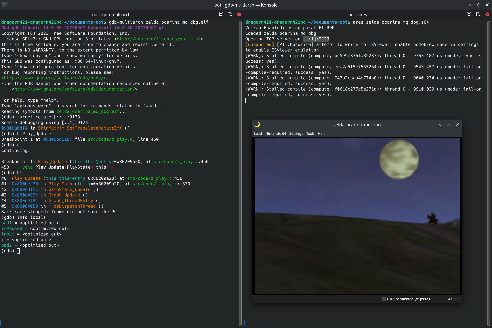
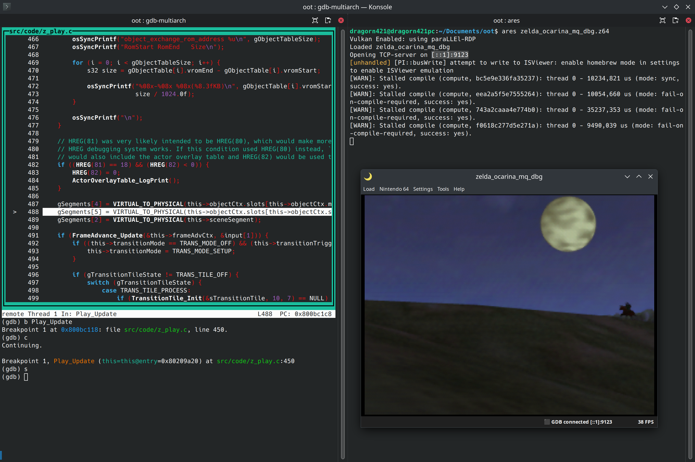
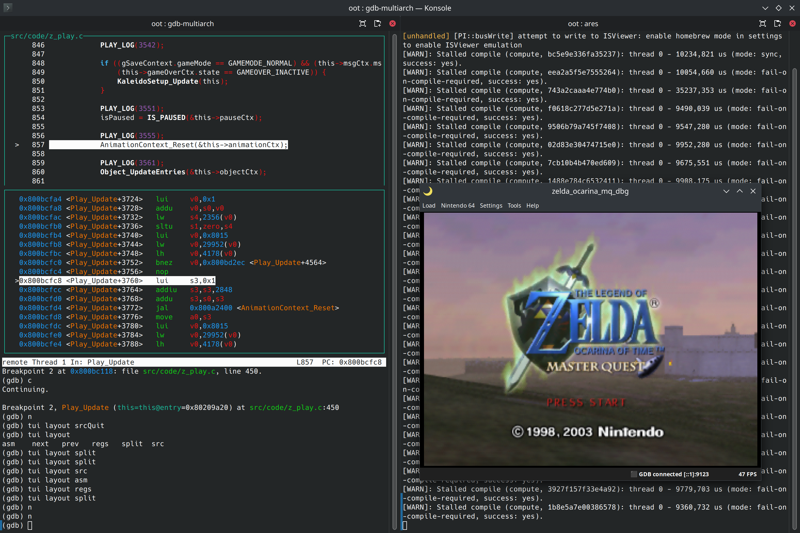

# Intro

This document shows how to get started with a gdb client in the terminal, which looks about like:



# Install gdb-multiarch

See [Install gdb-multiarch](install_gdb_multiarch.md).

# Connect to the gdb server

Run gdb-multiarch, passing it the elf file of the rom if you want (recommended, see [Compiling the ROM](rom_compiling.md))

If using WSL: your elf file is most likely in the WSL filesystem, but you're running gdb-multiarch in Windows. See [Windows: WSL filesystem drive](windows_mount_wsl_network_drive.md) to mount the WSL filesystem as a `Z:` drive you can then use to access the WSL filesystem. For example you may end up running `gdb-multiarch Z:/home/yourusername/oot/zelda_ocarina_mq_dbg.elf`.

You should see something like:

```
dragorn421@dragorn421pc:~/Documents/oot$ gdb-multiarch zelda_ocarina_mq_dbg.elf 
GNU gdb (Ubuntu 14.0.50.20230907-0ubuntu1) 14.0.50.20230907-git
Copyright (C) 2023 Free Software Foundation, Inc.
License GPLv3+: GNU GPL version 3 or later <http://gnu.org/licenses/gpl.html>
This is free software: you are free to change and redistribute it.
There is NO WARRANTY, to the extent permitted by law.
Type "show copying" and "show warranty" for details.
This GDB was configured as "x86_64-linux-gnu".
Type "show configuration" for configuration details.
For bug reporting instructions, please see:
<https://www.gnu.org/software/gdb/bugs/>.
Find the GDB manual and other documentation resources online at:
    <http://www.gnu.org/software/gdb/documentation/>.

For help, type "help".
Type "apropos word" to search for commands related to "word"...
Reading symbols from zelda_ocarina_mq_dbg.elf...
(gdb) 
```

`(gdb) ` indicates you may type commands. For help, type `help`. The GDB User Manual is available online at https://sourceware.org/gdb/documentation/

To connect to a gdb server through IP, use the command `target remote [::1]:9123` (replacing the address and port with yours). Make sure the gdb server is running already, or run it shortly after executing the command (for example with the ares gdb server, make sure ares is open, gdb server is enabled and the ROM is loaded).

If it worked, you should see something similar to the following, and the game should now be paused (as in, execution is paused).

```
(gdb) target remote [::1]:9123
Remote debugging using [::1]:9123
0x80006c4c in __osViInit ()
(gdb) 
```

The line `0x80006c4c in __osViInit ()` will probably be different for you and every time you connect. It indicates the location of the code the execution is currently at.

Note: you can pass `-ex 'COMMAND'` arguments to `gdb-multiarch` to execute commands. For example `gdb-multiarch zelda_ocarina_mq_dbg.elf -ex 'target remote [::1]:9123'` will run `target remote [::1]:9123`.

Note: you may have a better experience telling gdb to parse the debug information all at once on startup using the `-readnow` flag (for example `gdb-multiarch zelda_ocarina_mq_dbg.elf -readnow`). However it delays startup.

# Basic commands

Use `c` to resume execution.

Press ^C (it means Ctrl+C, hold Ctrl and press C) (with the terminal focused) to pause execution.

```c
(gdb) c
Continuing.
^C
Program received signal SIGTRAP, Trace/breakpoint trap.
0x800008b0 in Idle_ThreadEntry ()
(gdb) 
```

The location where execution is paused when hitting ^C is essentially random.

If you press enter without typing anything, in most cases the previously run command is executed again. (this is useful to step through a program)

Use `bt` to print the backtrace (a.k.a. stack trace), that is the function execution is currently in, and the function that called it, and so on.

```c
(gdb) bt
#0  Play_Update (this=this@entry=0x80209a20) at src/code/z_play.c:450
#1  0x800bec70 in Play_Main (thisx=0x80209a20) at src/code/z_play.c:1330
#2  0x800c311c in GameState_Update (gameState=gameState@entry=0x80209a20)
    at src/code/game.c:247
#3  0x800c493c in Graph_Update (gfxCtx=gfxCtx@entry=0x80160088 <sGraphStack+5264>, 
    gameState=gameState@entry=0x80209a20) at src/code/graph.c:281
#4  0x800c4f94 in Graph_ThreadEntry (arg0=<optimized out>) at src/code/graph.c:440
#5  0x80004050 in __osDispatchThread ()
Backtrace stopped: frame did not save the PC
```

Use `info args` to print function arguments, and `info locals` to print local variables. If a value is reported as `<optimized out>`, it may be you need to compile with debug flags (see [Compiling the ROM](rom_compiling.md)), or the variable may not have been assigned a value yet.

```c
(gdb) info args
this = 0x80209a20
(gdb) info locals
pad1 = <optimized out>
isPaused = <optimized out>
input = <optimized out>
i = <optimized out>
pad2 = <optimized out>
```

For MIPS registers, use `info registers` and `info float`.

## Evaluating expressions

Use `print` to evaluate any expression, including function calls.

For the following examples I have execution paused in `Play_Update(PlayState* this)`, allowing me to use `this` in the expressions to access the play state.

For example `print this->pauseCtx.state` prints the pause state (0 when unpaused):

```
(gdb) print this->pauseCtx.state
$10 = 0
```

For example `print Play_GetActiveCamId(this)` calls `Play_GetActiveCamId` and displays its result:

```
(gdb) print Play_GetActiveCamId(this)
$12 = 1
```

`Play_GetActiveCamId` is a function without [side-effects](https://en.wikipedia.org/wiki/Side_effect_(computer_science)), meaning calling it does not change the state of the program. But gdb doesn't limit you to only calling these functions, despite the command being named `print`.

For example `print Play_TriggerVoidOut(this)` will cause a void out:

```
(gdb) print Play_TriggerVoidOut(this)
$17 = void
```

You can also assign to data or variables. For example setting the rupee count:

```
(gdb) print gSaveContext.save.info.playerData.rupees = 69
$1 = 69
```

## Breakpoints

Use `b FUNCTION_NAME` to place a breakpoint on a function. When that function runs, execution will be paused automatically at the start of the function.

Note: you can use tab completion (pressing tab to auto-complete a command or argument).

For example `b Play_Update` places a breakpoint at the start of `Play_Update`. This is how it looks when the breakpoint is hit:

```c
Breakpoint 1, Play_Update (this=this@entry=0x80209a20) at src/code/z_play.c:450
450     void Play_Update(PlayState* this) {
```

NOTE: you can't yet place breakpoints in overlays (in code outside the boot and code segments), it won't work until we do something specific.

Use the `d` command to delete a breakpoint. For example `d Play_Update` to remove breakpoint(s) on `Play_Update`, or by breakpoint number `d 1`.

Use `d` on its own then answer `y` to delete all breakpoints at once.

Use `info b` to list active breakpoints.

## Stepping

Use `s` to step execution by one source code line, also entering subroutines (functions). The line printed after is the one that will be executed next (execution is paused before the line).

For example stepping from the `Play_Update` breakpoint:

```c
Breakpoint 1, Play_Update (this=this@entry=0x80209a20) at src/code/z_play.c:450
450     void Play_Update(PlayState* this) {
(gdb) s
459         if ((SREG(1) < 0) || (DREG(0) != 0)) {
(gdb) 
464         if ((R_HREG_MODE == HREG_MODE_PRINT_OBJECT_TABLE) && (R_PRINT_OBJECT_TABLE_TRIGGER < 0)) {
(gdb) 
482         if ((HREG(81) == 18) && (HREG(82) < 0)) {
(gdb) 
487         gSegments[4] = VIRTUAL_TO_PHYSICAL(this->objectCtx.slots[this->objectCtx.mainKeepSlot].segment);
(gdb) 
488         gSegments[5] = VIRTUAL_TO_PHYSICAL(this->objectCtx.slots[this->objectCtx.subKeepSlot].segment);
```

Use `n` to do about the same thing, but not entering subroutines (functions). That means, if a function is called, running `n` will have the functions run entirely and only pause execution after, whereas `s` would have stepped into the function and paused execution at the beginning of the called function.

Use `finish` to run until the end of the current function, pausing execution after the function returns.

# TUI

gdb has a Text User Interface. For more information see https://sourceware.org/gdb/current/onlinedocs/gdb.html/TUI.html

There are several layouts available showing different information. For example one shows the current source:

Run `tui layout src`:



The gdb area is separated in two "windows", one at the top showing source, one at the bottom for commands.

In the screenshot (and by default) the top source window is focused (notice it's highlighted). Using arrow keys will scroll the source view. Typing will type commands in the below window.

You can switch the focused window using `^X O` (Ctrl+X then O: hold Control, press X, release both, press O).

When execution is paused, such as in the above screenshot, the line execution is paused at is highlighted in the source window.

There are other TUI layouts available. For example you can also have an asm window along the source window (`tui layout split`):



# z64 overlays

To use gdb in z64 overlays such as most actors, see [GDB and z64 overlays](gdb_and_z64_overlays.md)
