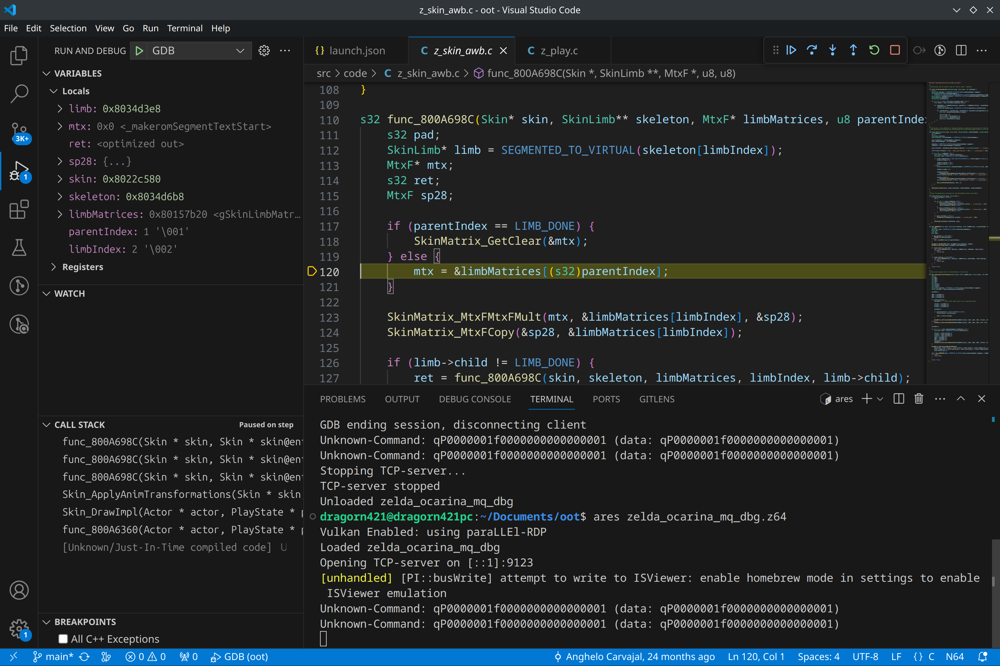

# Intro

This document shows how to get started with using VS Code as a gdb client, which looks about like:


# Prerequisites

## Install gdb-multiarch

See [Install gdb-multiarch](install_gdb_multiarch.md).

## Compiling the ROM

You need a .elf file, ideally with (at least some) debug information included.

See [Compiling the ROM](rom_compiling.md)

## If using Windows and WSL

With VS Code running in Windows, you need to provide it access to the WSL filesystem.

See [Windows: WSL filesystem drive](windows_mount_wsl_network_drive.md)

(there are other options but this seems like the best one)

# `launch.json`

At the root of the repo, create a folder `.vscode` (you may have one already), and a `launch.json` file inside.

You can also open a C file, go to the "Run and Debug" tab, and click "create a launch.json file".


```jsonc
{
    // Use IntelliSense to learn about possible attributes.
    // Hover to view descriptions of existing attributes.
    // For more information, visit: https://go.microsoft.com/fwlink/?linkid=830387
    "version": "0.2.0",
    "configurations": []
}
```

The configuration we want to add to `launch.json` depends on whether you're using [Windows](#windows-launchjson) or [Linux](#linux-launchjson).

## Windows `launch.json`

Add the following configuration, replacing both `Z:/path/to/oot` with your own (for example it may be `Z:/home/YOURUSERNAME/oot`).

Also change the `gdb-multiarch.exe` path if you installed it elsewhere, as well as the gdb server address/port `[::1]:9123` if needed.

```json
{
    "name": "GDB",
    "type": "cppdbg",
    "request": "launch",
    "program": "Z:/path/to/oot/zelda_ocarina_mq_dbg.elf",
    "cwd": "Z:/path/to/oot",
    "MIMode": "gdb",
    "miDebuggerPath": "C:/msys64/mingw64/bin/gdb-multiarch.exe",
    "miDebuggerServerAddress": "[::1]:9123",
    "miDebuggerArgs": "-readnow",
}
```

The full `launch.json` may look like:

```json
{
    "version": "0.2.0",
    "configurations": [
        {
            "name": "GDB",
            "type": "cppdbg",
            "request": "launch",
            "program": "Z:/path/to/oot/zelda_ocarina_mq_dbg.elf",
            "cwd": "Z:/path/to/oot",
            "MIMode": "gdb",
            "miDebuggerPath": "C:/msys64/mingw64/bin/gdb-multiarch.exe",
            "miDebuggerServerAddress": "[::1]:9123",
            "miDebuggerArgs": "-readnow",
        }
    ]
}
```

## Linux `launch.json`

Add the following configuration:

```json
{
    "name": "GDB",
    "type": "cppdbg",
    "request": "launch",
    "program": "${workspaceFolder}/zelda_ocarina_mq_dbg.elf",
    "cwd": "${workspaceFolder}",
    "MIMode": "gdb",
    "miDebuggerPath": "gdb-multiarch",
    "miDebuggerServerAddress": "[::1]:9123",
    "miDebuggerArgs": "-readnow",
}
```

The full `launch.json` may look like:

```json
{
    "version": "0.2.0",
    "configurations": [
        {
            "name": "GDB",
            "type": "cppdbg",
            "request": "launch",
            "program": "${workspaceFolder}/zelda_ocarina_mq_dbg.elf",
            "cwd": "${workspaceFolder}",
            "MIMode": "gdb",
            "miDebuggerPath": "gdb-multiarch",
            "miDebuggerServerAddress": "[::1]:9123",
            "miDebuggerArgs": "-readnow",
        }
    ]
}
```

## Additional configuration

You can add a bunch of things to the configuration. Here are some useful things:

You can add `"stopAtEntry": true,` to pause execution when gdb connects.

You can use `"miDebuggerArgs": "...",` to pass arguments to gdb-multiarch as if run on the command line. For example `"miDebuggerArgs": "-readnow",` passes `-readnow`, which makes gdb read all the debug information at once on startup.

# Running

Make sure the gdb server is running already, or run it shortly after launching VS Code debugging (for example with the ares gdb server, make sure ares is open, gdb server is enabled and the ROM is loaded).

To launch the configuration we just added, go to the "Run and Debug" tab and click the green triangle "play button" near the name of the configuration "GDB".


You may also have a keyboard shortcut to run a launch configuration (F5 by default).

Once launched, the gdb client should connect to the gdb server (the ares emulator in my screenshots).

You can see it worked when the Debug toolbar (the little bar with buttons that look like "blue pause, blue arrows, green rewind, red stop", highlighted on the next screenshot) has its "pause" button enabled (that you can click).

You may also see a sign from the server that a client connected. In the case of ares, the GDB status changed to "GDB connected".


If you added `"stopAtEntry": true,` to the configuration, the execution will be paused when gdb connects. You may also pause the execution at any time by clicking the pause icon.

When the execution pauses, the file and line corresponding to the code currently executing opens.



In the side panel can also be seen the current locals and their values, as well as the current stack trace.

For more information on debugging in VS Code, see https://code.visualstudio.com/Docs/editor/debugging

# Stepping

The debug toolbar allows stepping through the code:

- the first button pauses/resumes execution.
- the second button "step over" (dot and sideways arrow) steps by one source line, not entering functions. If a function is called on a line it is fully executed before going to the next line.
- the third button "step into" (dot and down arrow) steps by one source line, entering functions. If a function is called the execution will pause inside that called function.
- the fourth button "step out" (dot and up arrow) steps out of the current function, by continuing execution until the current function returns. Execution will be paused after the function returns.

The equivalents to these in the [terminal gdb client](terminal.md) are respectively ^C, `c`, `n`, `s`, `finish`.

To stop debugging, click the red stop button. The VS Code gdb client will disconnect and the game will keep running.

# Breakpoints

To place a breakpoint, which pauses execution when the line it is placed on is reached, click left of the line number in a source file where you want to put the breakpoint.


A red dot will appear in the margin, indicating a breakpoint. Click it again to remove it.

When the breakpoint is hit, execution is paused there:


# Running gdb commands

You may need to run gdb commands in VS Code as if using the [terminal gdb client](terminal.md). You can do so in the Debug Console with `-exec gdbcommand`.

For example `-exec help`:


results in

```
-exec help
List of classes of commands:
...
```

# z64 overlays

To use gdb in z64 overlays such as most actors, see [GDB and z64 overlays](gdb_and_z64_overlays.md).

Note: for running `source path/to/script.py` or `ovl ...` as explained in the linked document, don't forget to use `-exec` [as explained above](#running-gdb-commands). For example `-exec source path/to/script.py`.
